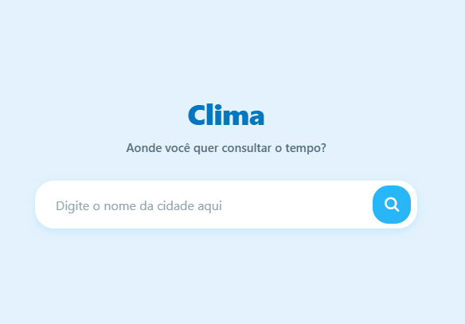
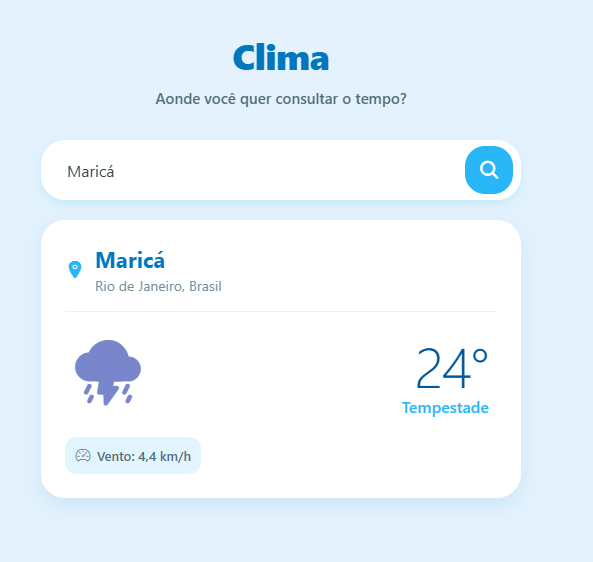
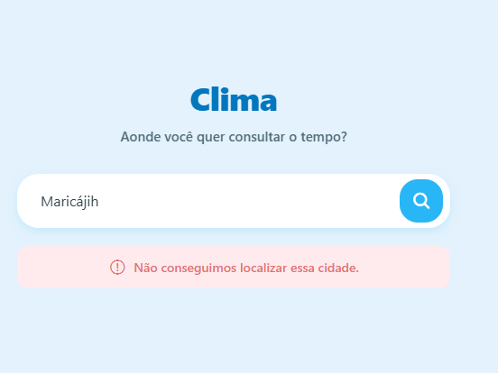

# ☁️ Clima

Uma experiência meteorológica harmônica, limpa e responsiva.  
Desenvolvido com **React Native** e **TypeScript**.

---

## 🎨 Galeria (UI/UX)

O design foi focado em harmonia visual e responsividade.  
O layout adapta-se elegantemente desde celulares pequenos até telas Desktop, mantendo o conteúdo centralizado e legível.

| Tela Inicial | Resultado | Erro |
|--------------|-----------|------|
|  |  |  |

## 📋 Sobre o Projeto

Este aplicativo não é apenas um buscador de clima; é um exercício de **Arquitetura Limpa** e **Design System**.  
O objetivo foi transformar uma simples requisição de API em uma interface:

- agradável  
- resiliente a erros do usuário  
- fácil de manter e evoluir  

---

## 🌟 Destaques da Implementação

### **Design Harmônico & Responsivo**
Uso de um `contentWrapper` com `maxWidth` para evitar que a interface “estique” em telas grandes, preservando a estética mobile mesmo no navegador.

### **Barra de Busca "Pill"**
Input e botão agrupados em um container arredondado com sombras (`elevation` + `shadowIOS`), criando uma identidade visual moderna.

### **Custom Hooks**
Toda a lógica de estado e requisição foi extraída para o hook `useWeatherService`, mantendo a View (`index.tsx`) focada apenas em renderização.

### **Sanitização de Dados**
Tratamento de:

- espaços acidentais (`trim()`)
- caracteres especiais na URL  
- prevenindo falhas comuns de digitação

---

## 🛠️ Stack Tecnológica

- **Core:** React Native + Expo Router  
- **Linguagem:** TypeScript (Interfaces estritas para `ForecastData`)  
- **API:** Open-Meteo (Geocoding + Forecast)  
- **Ícones:** Ionicons (`@expo/vector-icons`)  
- **Paleta:** Tons de Azul Céu (`#E3F2FD`, `#0277BD`) + Branco  

---

## 🚀 Como Rodar

Este projeto possui um script personalizado para execução.

### Instale as dependências:
```bash
npm install
