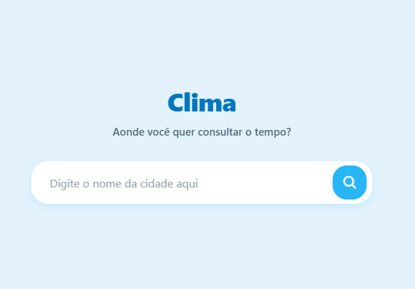
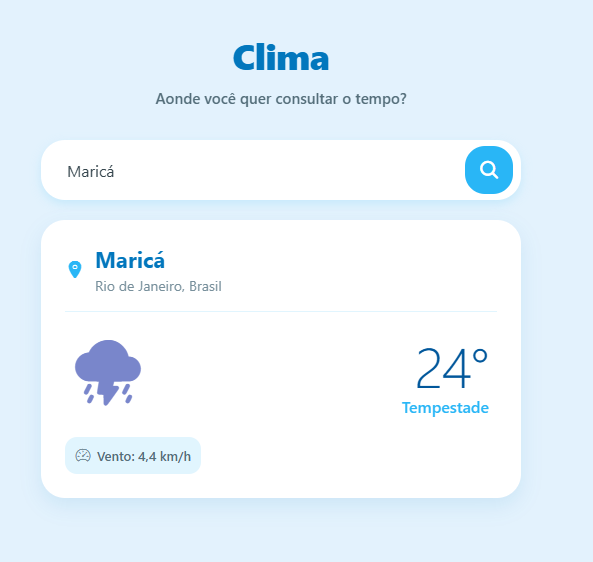
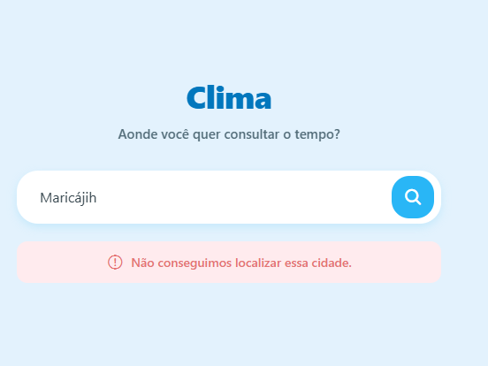

# Clima

Aplicativo de previsão do tempo em React Native e TypeScript. O usuário digita uma cidade e recebe temperatura, condição do céu e vento, com tratamento de erro amigável e layout que funciona do celular ao navegador.

Desenvolvido por **Mateus Chagas** ([LinkedIn](https://www.linkedin.com/in/mateusbchagas) · [GitHub](https://github.com/xmateuschagas)).

---

## Telas

| Inicial | Resultado | Erro |
|---|---|---|
|  |  |  |

---

## Problema e proposta de valor

Consultar o clima parece simples, mas uma interface frágil quebra fácil: espaço sobrando no nome da cidade, acento, cidade inexistente, API fora do ar. O objetivo aqui foi transformar duas chamadas de API em uma experiência resiliente e fácil de manter, separando bem regra de negócio e interface.

---

## Stack tecnológica

- **Linguagem:** TypeScript (tipagem estrita da resposta com a interface `ForecastData`)
- **Framework:** React Native + Expo (SDK 54) com Expo Router
- **APIs:** Open-Meteo Geocoding + Open-Meteo Forecast (sem necessidade de chave)
- **UI:** Ionicons (`@expo/vector-icons`), layout responsivo com `maxWidth`
- **Qualidade:** ESLint (`eslint-config-expo`)

---

## Arquitetura e fluxo de dados

```
Usuário digita a cidade
        │
        ▼
useWeatherService.handleSearch(query)
        │  trim() + encodeURIComponent()
        ▼
Open-Meteo Geocoding  ──►  latitude / longitude / nome / estado / país
        │
        ▼
Open-Meteo Forecast   ──►  temperatura / weathercode / vento
        │
        ▼
Estado tipado (ForecastData) ──► View renderiza ícone e cor pelo weathercode
```

**Decisões técnicas**

- **Custom hook (`useWeatherService`):** estado, requisições e tratamento de erro ficam fora da tela, que só renderiza.
- **Sanitização da entrada:** remoção de espaços e codificação de caracteres especiais antes de montar a URL.
- **Estados explícitos:** carregando, sucesso e erro tratados separadamente, com feedback visual em cada um.
- **Mapeamento de condição climática:** função pura que converte o `weathercode` em ícone, cor e rótulo.
- **Responsividade:** conteúdo centralizado com largura máxima, preservando a estética mobile no desktop.

---

## Como rodar

### Pré-requisitos

- Node.js 18 ou superior
- App Expo Go no celular, ou emulador Android/iOS, ou navegador

### Passo a passo

```bash
git clone https://github.com/xmateuschagas/clima.git
cd clima
npm install
npm run clima        # equivale a: expo start
```

Atalhos: `npm run android`, `npm run ios`, `npm run web`.

Não há variáveis de ambiente: a Open-Meteo é pública e não exige chave.

---

## Estrutura

```
app/
├── (tabs)/index.tsx   # Tela principal + hook useWeatherService
├── (tabs)/_layout.tsx # Navegação por abas
└── _layout.tsx        # Layout raiz (Expo Router)
components/            # Componentes de UI reutilizáveis
constants/theme.ts     # Tokens de tema
hooks/                 # Hooks de tema/cor
assets/                # Ícones e screenshots
```

---

## Autor

**Mateus Chagas**, Engenheiro de Software
[LinkedIn](https://www.linkedin.com/in/mateusbchagas) · [GitHub](https://github.com/xmateuschagas)
